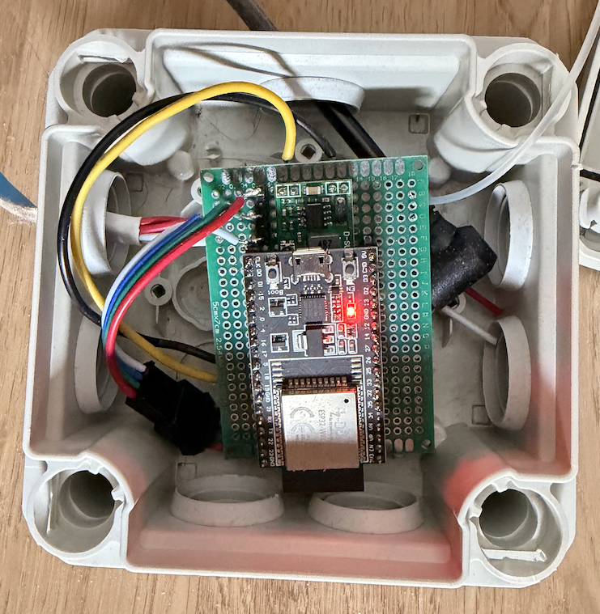
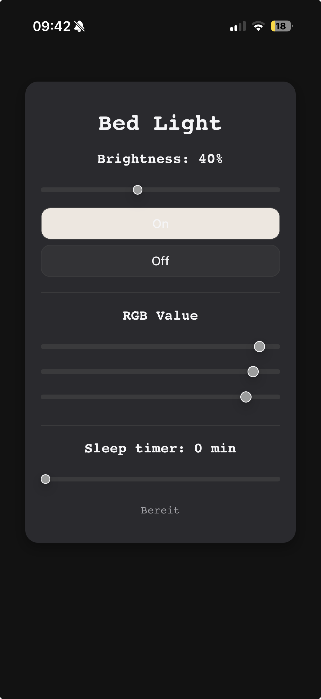

# 🌙 ESP32 Smart Bed Light

This is a custom, web-controlled under-bed lighting system built with an ESP32 and WS2812B NeoPixels. 

## 🚀 Why this is more than just an LED strip
I wanted a system that feels "premium"—no flickering, no blocking, and a clean way to control it from any device in the local network.

### Key Software Features:
* **FreeRTOS Multitasking:** The ESP32 runs two parallel tasks. One core handles the asynchronous **WebServer**, while the other dedicated core runs the **NeoPixel State Machine**. 
* **Thread Safety:** I implemented a **FreeRTOS Queue System** to send commands from the webserver task to the LED task. This prevents race conditions and ensures the animations stay buttery smooth even while the webserver is busy.
* **Non-Blocking State Machine:** The LED logic is built as a state machine. This allows for complex transitions like **Fade-In/Out** and a **Sleep Timer** without using a single `delay()`.
* **Custom Web UI:** A mobile-friendly dashboard served directly from the ESP32. It features RGB sliders, brightness control, and a sleep timer.

## 🛠️ Features
* **Smooth Transitions:** Graceful fading between colors and states.
* **Integrated Sleep Timer:** Set a duration (up to 60 min) via the UI; the light will automatically fade out once the time is up.
* **Live UI Feedback:** The "On" button in the web interface updates its color in real-time to match the slider positions.
* **Robust Connection:** A dedicated `WifiHandler` class manages the connection and provides detailed serial feedback.

## 📁 Technical Stack
* **Microcontroller:** ESP32 (Dual-Core)
* **LEDs:** 300 x WS2812B (NeoPixel)
* **Language:** C++ (Object-Oriented)
* **OS:** FreeRTOS
* **Communication:** HTTP / WebServer

## ⚙️ How to use
1.  Open `main.cpp` and enter your WiFi credentials (`ssid`, `password`).
2.  Flash the project using PlatformIO or the Arduino IDE.
3.  Find the ESP32's IP address in the Serial Monitor.
4.  Navigate to that IP in your browser and start customizing your light!

---
*Developed as a personal project to explore multitasking and HMI design on embedded systems.*
